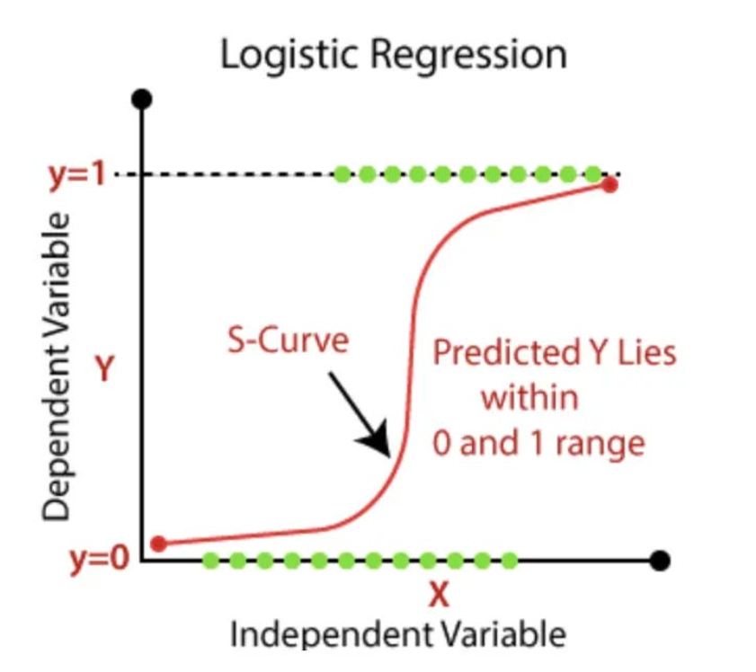
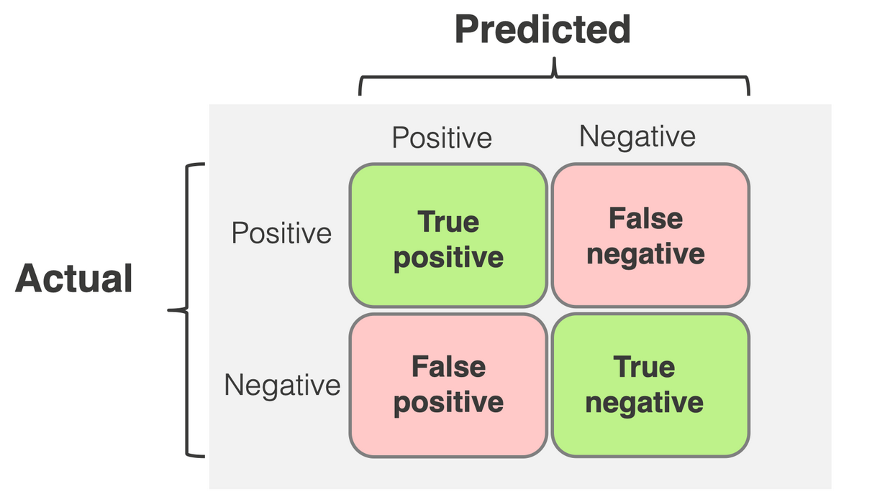

# Introduction

Last week, you practice the basics of predictive modelling for continuous variables. In practice, however, a lot of predictive modelling is dedicated to predicting binary or categorical variable, a process we call **classification**. This is because in many applied situations, we want to predict clear-cut behaviors: will the client buy from us or not? will an individual get sick or not? will the customer choose to watch movie X or movie Y? etc. As such, many of the most famous examples of predictive modelling relate to classification (e.g. face recognition algorithms, recommendation algorithms, etc...).

Predictive modelling for classification is built upon the same basic tenets as predictive modelling for continuous variables. You implement a model that you think will be good at predicting the outcome, train it on a train set, and test it on a test set. Then, you look at the model's **performance** (how good was it at predicting an object's class based on the information that you have). Here, just like with continuous variables, you may engage in cross-validation to maximize the reliability of you model performance measures (and all sorts of sensitivity checks).

Classification most differs from predicting continuous variables in the way we measure model performance. Metrics like RMSE or MAE are no longer relevant in the case of binary/categorical variables. Here, we need to introduce new concepts and metrics, like sensitivity, specificity, accuracy, precision, recall, F1 Score, AUC, ROC... That's a lot, but don't worry, we'll take it step by step.

The objective of this section is to build a "Diagnostic Classifier." (a classifier is just the name we give to a model that predicts categorical outcomes). Instead of predicting a score, we want to predict whether a patient has diabetes or not based on their clinical data (BMI, Glucose levels, etc.). This example will also highlight the applied value of predictive modelling.

### Part 1: Understanding predictions in logistic regressions

Our goal is to predict the `diabetes` variable. Since this is a binary outcome (0 = No, 1 = Yes), we need to build a classifier: a model that predicts categorical variables. There are countless techniques, some very sophisticated, to build these sorts of models. But you can actually build a quite solid classifier with just a simple model that you already know: the logistic regression. Thus, for this section, will run logistic regressions using the `glm()` function (Generalised Linear Model) with the argument `family = "binomial"`.

Remember, the output of a logistic regression is a **probability between 0 and 1**. We'll talk more about how we shift from a probability to a binary classification in a moment, but for now, let's look at how we can use predict() to predict probabilities.



#### Question 1

Choose the variables you think are most relevant and create a model. There are no good or wrong answers here. Don't sweat it too much, it's just for practice. Just run a model that makes sense and that you think will be effective at predicting diabetes. Then, run it and interpret the output.

#### Question 2

Your model has one or multiple independent variables (or "predictors"). Create a fictional individual and their characteristics on some of these variables (e.g. BMI and their age). Then, use the predict() function to determine what the model you created in Question 1 predicts as to its final grade.

```{r}
#| eval: false
#| echo: true
#On using the predict() function. Predict allows you to use a model on new data. 
#predict() works very much the same as for continuous variables, with a few exceptions

#To do so, the workflow is the following: 
#1) You use or create a dataset with "new" data. Of course, you need to make sure that this data contains all the information used in the model. For instance, if my model contains study time, failures, absences, internet access, and health condition, I should generate data like this:

fictional_student <- data.frame(
  studytime = 4,
  failures = 0,
  absences = 2,
  internet = "yes",
  health = 5
) #NB: here I only ask you for one new data point (i.e. one student), but you could build a dataset of multiple new students. 

#2) Use the model on this new data, using the following syntax. 
# Confidence intervals are more complex to determine for glms, so we're leaving this aside for now. This is why we remove the interval = "confidence", level = 0.95 arguments. 
#By default, predict() will output a logodds prediction, which is difficult to interpret. We use the type = "response" argument to get it to give us a probability prediction.


prediction <- predict(model1, newdata = fictional_student, type = "response")
prediction
```

### Part 2: Classification using logistic regression

A model that gives probabilities is useful, but in the real world, a doctor eventually has to decide: *"Does this patient have diabetes or not?"*. In logistic regressions, to transform a probability into a categorical outcome, we need to determine a threshold. For now, let us assume that the threshold is 0.5: when the p \> 0.5, the individual has diabetes, if not, they don't.

#### Question 3

Use predict() to create a vector of all predicted probabilities using your model for all participants in the dataset. The syntax is very simple: *predict(your_model, type = "response").* Just to check at whether everything is working fine, what is the mean predicted probability in your model?

#### Question 4

Implement the 0.5 threshold. Re-arrange the vector so that the value is "Yes" if p \> 0.5 and "No" if not. In predictive modelling, we often call the outcome categories "classes" (here, your classes are Yes and No). How many individuals do you have in each class? (you can use the table() function to achieve this). Are your classes balanced?

#### Question 5

Do exactly the same thing, but with a threshold of 0.9, and a threshold of 0.1. In both cases, how many individuals do you have in each class? Think about these results a little bit. How does the choice of a threshold influence the results of our classification? Does it matter in practice? If so, why?

#### Question 6

Let's go back to our classification model built on your logistic regression, with a threshold of p = 0.5. Split your dataset 80/20, with a train set and a test set. Train your model on your train set and use it on the test set. Compare the number of people that your model predicts to have diabetes to the actual number of people who have diabetes in the test set. How would you describe your model's performance?

### Part 3: Introducing the confusion matrix

Let's go back to our classification model built on your logistic regression, with a threshold of p = 0.5. You've seen in Question 6 that you can train a model on data, and have it classify new individuals as having diabetes or not. But how performant are these new predictions? How good is your model at correctly labeling patients? To answer, we need to compare our model predictions with the actual situation of people in the test set (i.e. whether they actually have diabetes or not). To do so, we need to build a confusion matrix (see figure below).



#### Question 7

Read this: <https://www.codestudy.net/blog/calculate-accuracy-and-precision-of-confusion-matrix/> (and you can easily find other resources to understand how to code a confusion matrix). Use the confusionMatrix() from the caret package to out put a confusion matrix. In addition to the confusion matrix itself, you should see a whole list of metrics. What is the *accuracy* of your model?

*NB: To use this function, you need to vectors, one for predicted and one for actual values. It's essential that both vectors are factors with the same label names. You may need to clean your vectors with the factor() function before you use confusionMatrix().*

NB2: The main metrics calculated from a confusion matrix can usually be calculated differently depending on what counts as the "positive" class. This is why it's important to specify it. In predictive modelling, we generally have a clear idea of the "positive class" (i.e. the phenomenon of interest we want to predict). In our case, the phenomenon of interest is "having diabetes", rather than "not having it". To specify this in confusionMatrix(), we need to add the argument *positive = "Yes"*.

NB3: Use the argument *mode = "everything"*. This allows you have have a wider spectrum of metrics, which will be useful to us.

#### Question 8

Read this:

Interpret the main metrics from the output:

-   Interpret the accuracy. Is it a reliable metric here?

-   Interpret sensitivity and specificity here. What does it tell us about the model performance?

-   Interpret the trio precision/recall/F1 score. What does it tell us about the model performance?

### Part 4: Introducing the confusion matrix

Now, we have a first idea about the performance of the model. However, there are still several problems with what we've done. First, we only have one train set and one test set: our results could be unreliable. Second, we are experiencing a very common problem in classification: class imbalance. In our case, there are much more people without diabetes than with diabetes. Class imbalance is an issue because it means that when you train your model, it has much more examples from one class than the other, so it can't learn properly.

The solution to the first problem is cross-validation. Fortunately, there are packages in R that allow us to automatically solve the second problem while cross-validating. Specifically, during cross-validation we can implement "down-sampling":

#### Question 9

Run the code below and interpret the results.

```{r}
#| eval: false
#| echo: true
# Define the rules
train_control_balanced <- trainControl(method = "cv", #means cross-validation
                                       number = 10, #10-fold cv
                                       classProbs = TRUE, 
                                       summaryFunction = prSummary,
                                       sampling = "down")

# Launch the model training
cv_model_balanced <- train(diabetes ~ age + bmi + blood_glucose_level + hypertension, 
                           data = data, 
                           method = "glm", 
                           family = "binomial",
                           metric = "F", 
                           trControl = train_control_balanced)

# Look at the results
print(cv_model_balanced)
```

Here is some background to understand the code.

-   You recognize the syntax from the caret package from the previous week. Remember the general logic: trainControl() defines the general rules of your model training. train() actually does the work. Your output depends on the argument you introduce in both functions.

-   We set classProbs = TRUE because we want the model to give us, for a start, the "probability" of having diabetes (like 0.82) before it gives us a "Yes" or "No." This is essential for calculating our new scorecard, prSummary, which stands for Precision-Recall. The latter argument is necessary because by default, this function only prints accuracy and another metric, Kappa.

-   We are telling R to focus on the **metric = "F"** (the F1-score), which is a balance between finding everyone who is sick and not being wrong when we make a prediction.

-   The most important part is the "magic line" sampling = "down". This fixes the class imbalance issue during the training phase that we discussed earlier. Basically, this tells R to even out the playing field by randomly removing some of the "No" cases during the training phase so the model is forced to learn what a "Yes" looks like.

#### Question 10

Run a similar cross-validation, this time using the bootstrap method for cross-validation instead of 10-fold CV. Interpret the results.

### Part 5: Lasso logistic regression for classification

Lasso is just equally useful and applicable to logistic regressions! It works just the same way and has the same interesting property of pushing coefficients towards 0.

#### Question 11

Using the same template as last week, implement a lasso logistic regression, and use cross-validation to determine the best lambda (or penalty factor). Note, just as in the previous questions, we want to measure performance on the basis of the F1 score, so we'll be using metric = "F" as an argument.

#### Question 12

Conclude on what you have learned on predicting diabetes.
